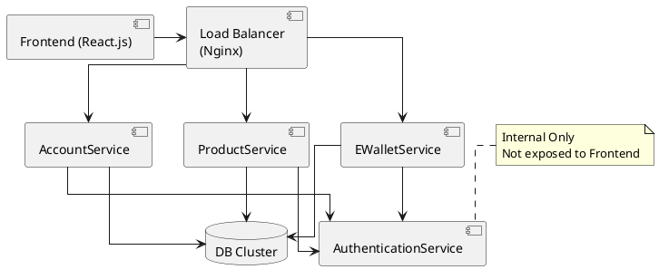

# E-commerce

```plantuml
@startuml
skinparam linetype ortho

' Define front-end
component "Frontend (React.js)" as Frontend

' Define load balancer
component "Load Balancer\n(Nginx)" as LB

' Define services
component "AccountService" as AccountService
component "ProductService" as ProductService
component "EWalletService" as TransactionService
component "AuthenticationService" as AuthService

' Define DB cluster
database "DB Cluster" as DB

' Connections from Frontend
Frontend -> LB

' Load balancer routes to services
LB --> AccountService
LB --> ProductService
LB --> TransactionService

' Internal services call AuthenticationService
AccountService --> AuthService
ProductService --> AuthService
TransactionService --> AuthService

note top of AuthService
  Internal Only
  Not exposed to Frontend
end note

' All services connect to DB cluster
AccountService --> DB
ProductService --> DB
TransactionService --> DB

@enduml
```