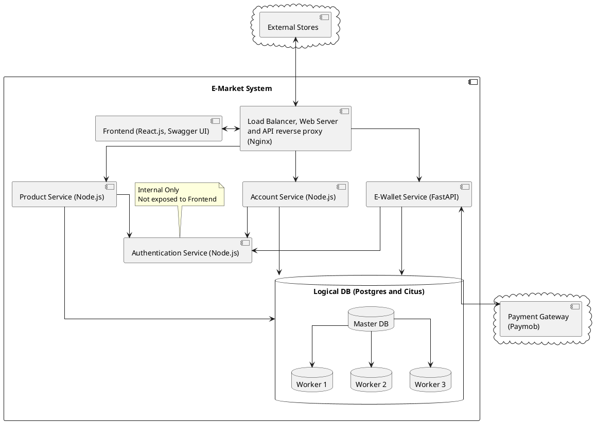

# E-commerce

```plantuml
@startuml
skinparam linetype ortho

cloud {
    component "External Stores" as ExternalStores
}

cloud {
' Define external services
component "Payment Gateway\n(Paymob)" as PaymentGateway
}

component "E-Market System\n" {
' Define front-end
component "Frontend (React.js, Swagger UI)" as Frontend

' Define load balancer
component "Load Balancer, Web Server\nand API reverse proxy\n(Nginx)" as LB

' Define services
component "Account Service (Node.js)" as AccountService
component "Product Service (Node.js)" as ProductService
component "E-Wallet Service (FastAPI)" as TransactionService
component "Authentication Service (Node.js)" as AuthService

' Define DB cluster
database "Logical DB (Postgres and Citus)" as DB {
    database "Master DB" as MasterDB
    database "Worker 1" as W1
    database "Worker 2" as W2
    database "Worker 3" as W3
}

' Define DB cluster connections
MasterDB --> W1
MasterDB --> W2
MasterDB --> W3

' Connections from Frontend
Frontend <-> LB

' Load balancer routes to services
LB --> AccountService
LB --> ProductService
LB --> TransactionService

' Internal services call AuthenticationService
AccountService --> AuthService
ProductService --> AuthService
TransactionService --> AuthService

note top of AuthService
  Internal Only
  Not exposed to Frontend
end note

' All services connect to DB cluster
AccountService ---> DB
ProductService ---> DB
TransactionService ---> DB
}

TransactionService <---> PaymentGateway
ExternalStores <---> LB
@enduml
```